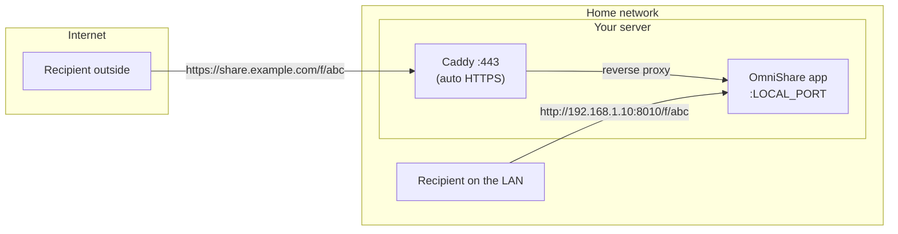

# OmniShare

**EN** | [RU](README.ru.md)

[](https://github.com/frum1/omnishare/actions/workflows/publish.yml)
[](LICENSE)
[](pyproject.toml)

Self-hosted file sharing with **dual links**: one public, one LAN. Every file takes the shortest path to whoever you sent it to.


## Why

The goal of this project is a sharing service that works equally well **inside
a home network and on a public internet domain — at the same time, from one
instance**.

Most self-hosted sharing tools assume a single canonical URL. But when the
server lives in your home, that assumption breaks down:

- The public domain resolves to your router's external IP. From inside the
  LAN, that means hairpin NAT — which some routers don't support at all, and
  others route slowly.
- Even when it works, sending a file to the computer in the next room via
  your ISP's uplink is silly. A direct LAN transfer runs at full local speed.
- And if your internet connection is down, the local link keeps working.

OmniShare treats both worlds as first-class: it knows both the public and the
LAN address of the server, generates both URLs for every file, and lets you
copy whichever fits the recipient.

## Features

- **Dual share links** — public (`https://share.example.com/f/…`) and local
  (`http://192.168.x.x:8010/f/…`) for every upload.
- **Resumable uploads** — implements the [TUS protocol](https://tus.io/), so
  large uploads survive dropped connections and resume where they left off.
- **Link lifecycle controls** — optional expiry time and download limit per
  file; expired files are deleted automatically (on access and by a
  background sweep).
- **Captions** — attach a short description to any file.
- **Multi-user** — admin panel for creating users, per-user storage quotas,
  one-click password resets with a forced change on next login.
- **Zero-config startup** — the root admin account is created on first boot;
  network settings can be changed from the admin panel at runtime and are
  persisted back to `.env`.
- **Simple deployment** — a single container with SQLite (no external
  database), plus an optional bundled Caddy that obtains and renews a Let's
  Encrypt certificate automatically.
- **Web UI** — a Vue 3 single-page app, developed in
  [frum1/omnishare_frontend](https://github.com/frum1/omnishare_frontend).

### Access model

**Uploading requires an account.** There is no open registration — the admin
creates users from the admin panel, and each gets a storage quota.

**Downloading does not.** Share links are unauthenticated: anyone holding the
URL can fetch the file. Treat a link as the credential. Where that isn't
enough, give the file an expiry time, a download limit, or both.

## How it works

One instance, two ways in. Remote recipients come through your domain and the
Caddy reverse proxy; devices on your home network hit the app directly by LAN
IP, no internet round-trip involved:



The local URL is set with `LOCAL_BASE_URL` (your server's LAN address). The
public URL is whatever you configure in `PUBLIC_BASE_URL` — typically a domain
fronted by the bundled Caddy, but any reverse proxy works.

## Quick start (Docker)

No need to clone the repository — two files are enough:

```bash
mkdir omnishare && cd omnishare

curl -fsSLO https://raw.githubusercontent.com/frum1/omnishare/main/docker-compose.yml
[ -f .env ] || curl -fsSL https://raw.githubusercontent.com/frum1/omnishare/main/.env.example -o .env
```

Open `.env` and set **`LOCAL_BASE_URL`** to your server's LAN address,
including the port — for example `http://192.168.1.10:8010`. Everything else
has sane defaults, and `PUBLIC_BASE_URL` can stay empty until you're ready to
put the instance on a domain (see [Public HTTPS](#public-https-domain--certificate)).

```bash
docker compose up -d
```

That's the whole setup for a LAN / HTTP (not recommended) deployment. The
image is pulled from
[ghcr.io/frum1/omnishare](https://github.com/frum1/omnishare/pkgs/container/omnishare).

> **Don't use `localhost` in `LOCAL_BASE_URL`.** A `localhost` link only ever
> resolves on the server itself — open it on your phone and the phone will try
> to serve it. Use the machine's LAN IP, and pin it in your router's DHCP
> settings so it doesn't drift.

The container uses **host networking**, so the service listens on the host
directly — no port mapping needed, it's reachable on `LOCAL_PORT` (the example
`.env` sets 8010). Host networking is a Linux feature; on Docker Desktop for
macOS or Windows, replace `network_mode: host` with a `ports: ["8010:8010"]`
mapping.

Persistent data lives in bind mounts next to the compose file:

| Path       | Contents                                                                                                        |
| ---------- | --------------------------------------------------------------------------------------------------------------- |
| `data/`    | SQLite database + auto-generated `secret_key`                                                                   |
| `storage/` | Uploaded files                                                                                                  |
| `.env`     | Settings — bind-mounted (not just `env_file:`) because changes made in the admin panel are written back into it |

Because the admin panel rewrites `.env`, the file must be **writable** by the
container. Note that a rewrite normalises the file: comments and formatting
you added by hand may not survive it.

### First login

On first boot the server creates a root `admin` account and prints its
generated password to the console:

```bash
docker compose logs omnishare
```

Log in with it and you'll be prompted to set a new password. Lost it? Reset
it with the following command:

```bash
docker compose exec omnishare python -m scripts.reset_admin_password
```

## Public HTTPS (domain + certificate)

To expose OmniShare on the internet under your own domain with a trusted
certificate, enable the bundled Caddy reverse proxy — it obtains and renews a
Let's Encrypt certificate automatically.

Prerequisites:

- A domain (or subdomain) with DNS pointed at this server's public IP.
- Ports **80** and **443** forwarded to this machine on your router/firewall
  (80 is required for the ACME challenge, not just for redirects).

Setup — two lines in `.env`, then the same `up`:

```bash
# in .env:
# PUBLIC_BASE_URL=https://share.example.com
# COMPOSE_PROFILES=proxy

docker compose up -d
```

`COMPOSE_PROFILES=proxy` brings up a `caddy` container alongside `omnishare`;
its config is inlined in `docker-compose.yml` and uses `PUBLIC_BASE_URL` as
the site address, so Caddy proxies to the app and manages the certificate on
its own. Remove that line for a plain-HTTP / LAN-only setup.

Since both containers share the host's network namespace, Caddy reaches the
app over loopback rather than by service name:

```caddyfile
{$PUBLIC_BASE_URL} {
    reverse_proxy localhost:{$LOCAL_PORT}
}
```

Swap in your own proxy if you prefer — anything that forwards to
`localhost:LOCAL_PORT` and sets `X-Forwarded-Proto` will do.

> ### ⚠️ Firewall the app port
>
> With host networking the app binds to **every** interface, including the
> public one. Once you forward 80/443 at the router, double-check that
> `LOCAL_PORT` isn't reachable from outside — otherwise `http://<public-ip>:8010`
> serves the app over plain HTTP, bypassing Caddy and your certificate
> entirely.
>
> Restrict it to the LAN:
>
> ```bash
> sudo ufw allow from 192.168.0.0/16 to any port 8010 proto tcp
> sudo ufw deny 8010/tcp
> ```
>
> After that the only route in from the internet is Caddy on 443.

## Configuration

All settings live in `.env` — see [.env.example](.env.example) for the full
annotated list (public/local URLs, port, file size limit, cleanup interval,
token lifetime, and more). The essentials:

| Variable          | Default | Description                                                                                                                                                             |
| ----------------- | ------- | ----------------------------------------------------------------------------------------------------------------------------------------------------------------------- |
| `LOCAL_BASE_URL`  | —       | The server's LAN address, used to build local links. **Include the port**, e.g. `http://192.168.1.10:8010`.                                                             |
| `LOCAL_PORT`      | `8010`  | The port the app binds to. Changing it does not change `LOCAL_BASE_URL` — keep the two in sync yourself.                                                                |
| `PUBLIC_BASE_URL` | —       | The public URL for share links, and Caddy's site address when the proxy profile is enabled. No port unless it's non-standard: `https://share.example.com`, not `…:443`. |
| `LOCAL_MODE`      | `true`  | Whether the UI offers a local-network link alongside the public one. Set `false` on a VPS, where there is no meaningful LAN.                                            |

Network settings can also be changed at runtime from the admin panel; changes
are written back to `.env` so they survive restarts.

## Development

Clone the repository and install the backend dependencies:

```bash
git clone https://github.com/frum1/omnishare.git
cd omnishare

uv sync

cp .env.example .env
# edit .env: PUBLIC_BASE_URL, etc. (see inline comments)
```

The backend serves the web UI from `dist/`, which is built in a separate
repository — grab the latest build from the
[frum1/omnishare_frontend releases](https://github.com/frum1/omnishare_frontend/releases)
(the `frontend-dist-*.tar.gz` asset) and unpack it:

```bash
gh release download --repo frum1/omnishare_frontend --pattern '*.tar.gz'
mkdir -p dist && tar -xzf frontend-dist-*.tar.gz -C dist && rm frontend-dist-*.tar.gz
```

Then run the server:

```bash
uv run main.py
```

To build the Docker image from source instead of pulling it from GHCR,
uncomment `build: .` in `docker-compose.yml` (the build fetches the frontend
release on its own).

### Dev mode (API docs)

Swagger/ReDoc are disabled by default to reduce the attack surface on a
publicly-exposed instance. Create an empty `.dev-mode` file in the project
root to enable them at `/docs` and `/redoc`:

```bash
touch .dev-mode
```

The check happens once at startup, so restart the server after adding or
removing the file.

### Frontend

The web UI is a separate project:
[frum1/omnishare_frontend](https://github.com/frum1/omnishare_frontend)
(Vue 3 + PrimeVue). The backend serves its built output from `dist/`; the
Docker build fetches the latest frontend release automatically, so you only
need that repo if you're working on the UI itself.

## Tech stack

- **Backend:** [FastAPI](https://fastapi.tiangolo.com/) + async SQLAlchemy
  on SQLite, JWT auth, [uv](https://docs.astral.sh/uv/) for dependency
  management.
- **Uploads:** TUS 1.0 (creation & termination extensions), streamed to disk
  in chunks; files are stored in a date + id-sharded tree under `storage/`.
- **Frontend:** Vue 3 + PrimeVue SPA, served by the backend.
- **Deployment:** Docker (host networking), optional Caddy profile for
  automatic HTTPS; images published to GHCR on every version tag.

## License

[GPL-3.0](LICENSE) — copyleft, and proudly so.
