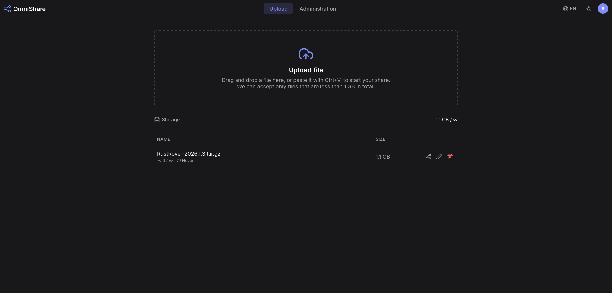
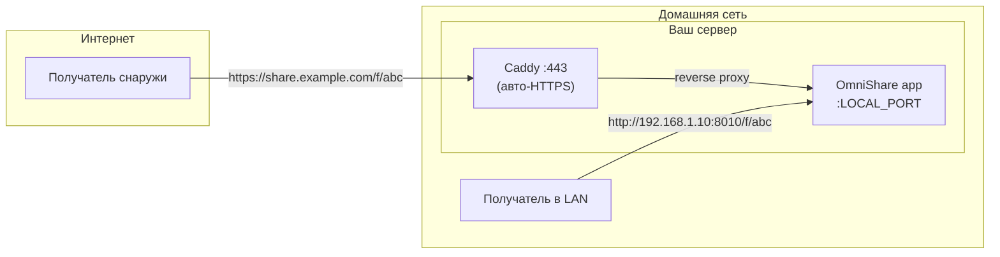

# OmniShare

[EN](README.md) | **RU**

[](https://github.com/frum1/omnishare/actions/workflows/publish.yml)
[](LICENSE)
[](pyproject.toml)

Self-hosted файлообменник с **двумя ссылками**: одна публичная, одна локальная. Каждый файл идёт к получателю кратчайшим путём.



## Зачем

Цель проекта - сервис обмена файлами, который одинаково хорошо работает
**и внутри домашней сети, и на публичном домене в интернете - одновременно,
из одного экземпляра**.

Большинство self-hosted файлообменников рассчитаны на один URL.
Но когда сервер стоит дома, эта схема ломается:

- Публичный домен резолвится во внешний IP вашего роутера. Изнутри локальной
  сети это означает hairpin NAT - который часть роутеров не поддерживает
  вовсе, а часть обрабатывает медленно.
- Даже когда это работает, гонять файл на устройство в соседней комнате через
  канал провайдера - неразумно. Прямая передача по LAN идёт на полной локальной
  скорости.
- А если интернет упал, локальная ссылка продолжает работать.

OmniShare считает оба мира равноправными: он знает и публичный, и локальный
адрес сервера, генерирует оба URL для каждого файла и позволяет скопировать
тот, который подходит получателю.

## Возможности

- **Двойные ссылки** — публичная (`https://share.example.com/f/…`) и
  локальная (`http://192.168.x.x:8010/f/…`) для каждой загрузки.
- **Возобновляемые загрузки** — реализован [протокол TUS](https://tus.io/):
  большие загрузки переживают обрыв соединения и продолжаются с того же
  места.
- **Управление жизнью ссылки** — опциональный срок действия и лимит
  скачиваний для каждого файла; просроченные файлы удаляются автоматически
  (при обращении и фоновой чисткой).
- **Подписи** — к любому файлу можно прикрепить короткое описание.
- **Пользователи и квоты** — админ-панель для создания пользователей,
  квоты на хранилище, сброс пароля в один клик с принудительной сменой при
  следующем входе.
- **Запуск без настройки** — root-админ создаётся при
  первом старте; сетевые настройки меняются из админ-панели на лету и
  сохраняются обратно в `.env`.
- **Простое развёртывание** — один контейнер с SQLite (без внешней базы),
  плюс опциональный Caddy в комплекте, который сам получает и продлевает
  сертификат Let's Encrypt.
- **Веб-интерфейс** — одностраничное приложение на Vue 3, разрабатывается в
  [frum1/omnishare_frontend](https://github.com/frum1/omnishare_frontend).

### Модель доступа

**Для загрузки нужен аккаунт.** Открытой регистрации нет — пользователей
создаёт админ из админ-панели, каждому назначается квота на хранилище.

**Для скачивания — не нужен.** Ссылки на файлы не требуют авторизации: файл может получить любой, у кого есть URL. Относитесь к ссылке как к паролю. Там, где этого мало,
задайте файлу срок действия, лимит скачиваний или и то и другое.

## Как это работает

Один экземпляр, два входа. Внешние получатели приходят через ваш домен и
реверс-прокси Caddy; устройства в домашней сети обращаются к приложению
напрямую по LAN IP, без круга через интернет:



Локальный URL задаётся через `LOCAL_BASE_URL` (LAN-адрес вашего сервера).
Публичный — тем, что вы укажете в `PUBLIC_BASE_URL`: обычно это домен за
Caddy из комплекта, но подойдёт любой реверс-прокси.

## Быстрый старт (Docker)

Клонировать репозиторий не нужно — достаточно двух файлов:

```bash
mkdir omnishare && cd omnishare

curl -fsSLO https://raw.githubusercontent.com/frum1/omnishare/main/docker-compose.yml
[ -f .env ] || curl -fsSL https://raw.githubusercontent.com/frum1/omnishare/main/.env.example -o .env
```

Откройте `.env` и задайте **`LOCAL_BASE_URL`** — LAN-адрес вашего сервера,
включая порт, например `http://192.168.1.10:8010`. Остальные значения можно не трогать, а `PUBLIC_BASE_URL` может оставаться пустым,
пока вы не готовы вывести сервис на домен (см.
[Публичный HTTPS](#публичный-https-домен--сертификат)).

```bash
docker compose up -d
```

Это вся настройка для LAN / HTTP(не рекомендуется) развёртывания. Образ берётся из
[ghcr.io/frum1/omnishare](https://github.com/frum1/omnishare/pkgs/container/omnishare).

> **Не используйте `localhost` в `LOCAL_BASE_URL`.** Ссылка с `localhost`
> резолвится только на самом сервере — откройте её на телефоне, и телефон
> будет искать файл у себя. Указывайте LAN IP машины и закрепите его в
> DHCP-настройках роутера, чтобы адрес не «уплывал».

Контейнер использует **host networking**: сервис слушает прямо на хосте —
проброс портов не нужен, он доступен на `LOCAL_PORT` (в примере `.env` это
8010). Host networking — фича Linux; на Docker Desktop для macOS или Windows
замените `network_mode: host` на проброс `ports: ["8010:8010"]`.

Постоянные данные живут в bind-маунтах рядом с compose-файлом:

| Путь       | Содержимое                                                                                                       |
| ---------- | ---------------------------------------------------------------------------------------------------------------- |
| `data/`    | База SQLite + автосгенерированный`secret_key`                                                                    |
| `storage/` | Загруженные файлы                                                                                                |
| `.env`     | Настройки — примонтирован как bind (а не просто`env_file:`), потому что изменения из админ-панели пишутся в него |

Поскольку админ-панель перезаписывает `.env`, файл должен быть **доступен на
запись** контейнеру. Учтите: перезапись нормализует файл — добавленные вами
вручную комментарии и форматирование могут не сохраниться.

### Первый вход

При первом старте сервер создаёт root-аккаунт `admin` и печатает
сгенерированный пароль в консоль:

```bash
docker compose logs omnishare
```

Войдите с ним, а сервис попросит задать новый пароль. Потеряли его? Сбросьте через команду.

```bash
docker compose exec omnishare python -m scripts.reset_admin_password
```

## Публичный HTTPS (домен + сертификат)

Чтобы хостить OmniShare в интернет на собственном домене с сертификатом, включите Caddy из комплекта — он сам получает и продлевает сертификат Let's Encrypt.

Что понадобится:

- Домен (или поддомен) с DNS-записью, указывающей на публичный IP этого
  сервера.
- Порты **80** и **443**, проброшенные на эту машину на роутере/файрволе
  (80 нужен для ACME-челленджа, а не только для редиректов).

Настройка — две строки в `.env`, затем тот же `up`:

```bash
# в .env:
# PUBLIC_BASE_URL=https://share.example.com
# COMPOSE_PROFILES=proxy

docker compose up -d
```

`COMPOSE_PROFILES=proxy` поднимает контейнер `caddy` рядом с `omnishare`; его
конфиг встроен в `docker-compose.yml` и использует `PUBLIC_BASE_URL` как
адрес сайта — Caddy проксирует запросы в приложение и сам управляет
сертификатом. Уберите эту строку для plain-HTTP / LAN-only установки.

Поскольку оба контейнера делят сетевое пространство хоста, Caddy ходит в
приложение через loopback, а не по имени сервиса:

```caddyfile
{$PUBLIC_BASE_URL} {
    reverse_proxy localhost:{$LOCAL_PORT}
}
```

Хотите свой прокси — пожалуйста: подойдёт всё, что форвардит на
`localhost:LOCAL_PORT` и выставляет `X-Forwarded-Proto`.

> ### ⚠️ Закройте порт приложения файрволом
>
> С host networking приложение слушает на **всех** интерфейсах, включая
> публичный. Пробросив 80/443 на роутере, проверьте, что `LOCAL_PORT`
> недоступен снаружи — иначе `http://<публичный-ip>:8010` отдаёт приложение
> по голому HTTP в обход Caddy и вашего сертификата.
>
> Ограничьте порт локальной сетью:
>
> ```bash
> sudo ufw allow from 192.168.0.0/16 to any port 8010 proto tcp
> sudo ufw deny 8010/tcp
> ```
>
> После этого единственный путь из интернета — Caddy на 443.

## Конфигурация

Все настройки живут в `.env` — полный аннотированный список смотрите в
[.env.example](.env.example) (публичный/локальный URL, порт, лимит размера
файла, интервал чистки, время жизни токена и другое). Главное:

| Переменная        | По умолчанию | Описание                                                                                                                                                 |
| ----------------- | ------------ | -------------------------------------------------------------------------------------------------------------------------------------------------------- |
| `LOCAL_BASE_URL`  | —            | LAN-адрес сервера, из которого строятся локальные ссылки. **Указывайте с портом**, например `http://192.168.1.10:8010`.                                  |
| `LOCAL_PORT`      | `8010`       | Порт, на котором слушает приложение. Его смена не меняет`LOCAL_BASE_URL` — синхронизируйте их сами.                                                      |
| `PUBLIC_BASE_URL` | —            | Публичный URL для ссылок и адрес сайта для Caddy при включённом профиле proxy. Без порта, если он стандартный:`https://share.example.com`, а не `…:443`. |
| `LOCAL_MODE`      | `true`       | Предлагать ли в UI локальную ссылку рядом с публичной. Ставьте`false` на условной VPS, где осмысленной LAN нет.                                          |

Сетевые настройки можно менять и на лету из админ-панели; изменения пишутся
обратно в `.env` и переживают перезапуск.

## Разработка

Склонируйте репозиторий и установите зависимости бэкенда:

```bash
git clone https://github.com/frum1/omnishare.git
cd omnishare

uv sync

cp .env.example .env
# отредактируйте .env: PUBLIC_BASE_URL и т.д. (см. комментарии внутри)
```

Бэкенд отдаёт веб-интерфейс из `dist/`, который собирается в отдельном
репозитории — возьмите последний билд из
[релизов frum1/omnishare_frontend](https://github.com/frum1/omnishare_frontend/releases)
(ассет `frontend-dist-*.tar.gz`) и распакуйте:

```bash
gh release download --repo frum1/omnishare_frontend --pattern '*.tar.gz'
mkdir -p dist && tar -xzf frontend-dist-*.tar.gz -C dist && rm frontend-dist-*.tar.gz
```

Затем запустите сервер:

```bash
uv run main.py
```

Чтобы собрать Docker-образ из исходников вместо загрузки из GHCR,
раскомментируйте `build: .` в `docker-compose.yml` (сборка сама скачает
релиз фронтенда).

### Dev-режим (документация API)

Swagger/ReDoc по умолчанию отключены — меньше поверхность атаки у публично
доступного экземпляра. Создайте пустой файл `.dev-mode` в корне проекта,
чтобы включить их на `/docs` и `/redoc`:

```bash
touch .dev-mode
```

Проверка выполняется один раз при старте, поэтому после добавления или
удаления файла перезапустите сервер.

### Фронтенд

Веб-интерфейс — отдельный проект:
[frum1/omnishare_frontend](https://github.com/frum1/omnishare_frontend)
(Vue 3 + PrimeVue). Бэкенд отдаёт его собранный вывод из `dist/`;
Docker-сборка скачивает последний релиз фронтенда автоматически, так что этот
репозиторий нужен, только если вы работаете над самим UI.

## Технологии

- **Бэкенд:** [FastAPI](https://fastapi.tiangolo.com/) + асинхронный
  SQLAlchemy поверх SQLite, JWT-аутентификация,
  [uv](https://docs.astral.sh/uv/) для управления зависимостями.
- **Загрузки:** TUS 1.0 (расширения creation и termination), потоковая
  запись на диск чанками; файлы лежат в дереве `storage/`, шардированном по
  дате и id.
- **Фронтенд:** SPA на Vue 3 + PrimeVue, отдаётся бэкендом.
- **Развёртывание:** Docker (host networking), опциональный профиль Caddy
  для автоматического HTTPS; образы публикуются в GHCR на каждый тег версии.

## Лицензия

[GPL-3.0](LICENSE) — copyleft, и этим гордимся.
